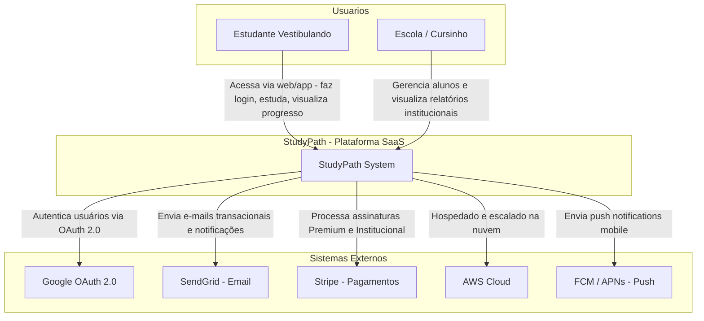

# C4 — Nível Context (C1): StudyPath

## Diagrama

## Elementos

| Elemento | Tipo | Descrição |
|----------|------|-----------|
| Estudante Vestibulando | Pessoa | Usuário principal. Acessa via app mobile ou web para estudar, praticar questões e acompanhar progresso. |
| Escola / Cursinho | Pessoa/Org | Administrador institucional. Cadastra alunos em lote e monitora desempenho da turma. |
| StudyPath [SaaS] | Sistema | Sistema principal. Gerencia cronogramas, questões, flashcards, desempenho e assinaturas. |
| Google OAuth 2.0 | Externo | Provedor de identidade para login social seguro. |
| SendGrid | Externo | Serviço de e-mail transacional para notificações e lembretes. |
| Stripe | Externo | Gateway de pagamento para planos Premium e Institucional. |
| AWS Cloud | Infra | Hospeda todos os serviços, bancos de dados e armazenamento. |
| FCM / APNs | Externo | Firebase Cloud Messaging e Apple Push Notification Service. |
