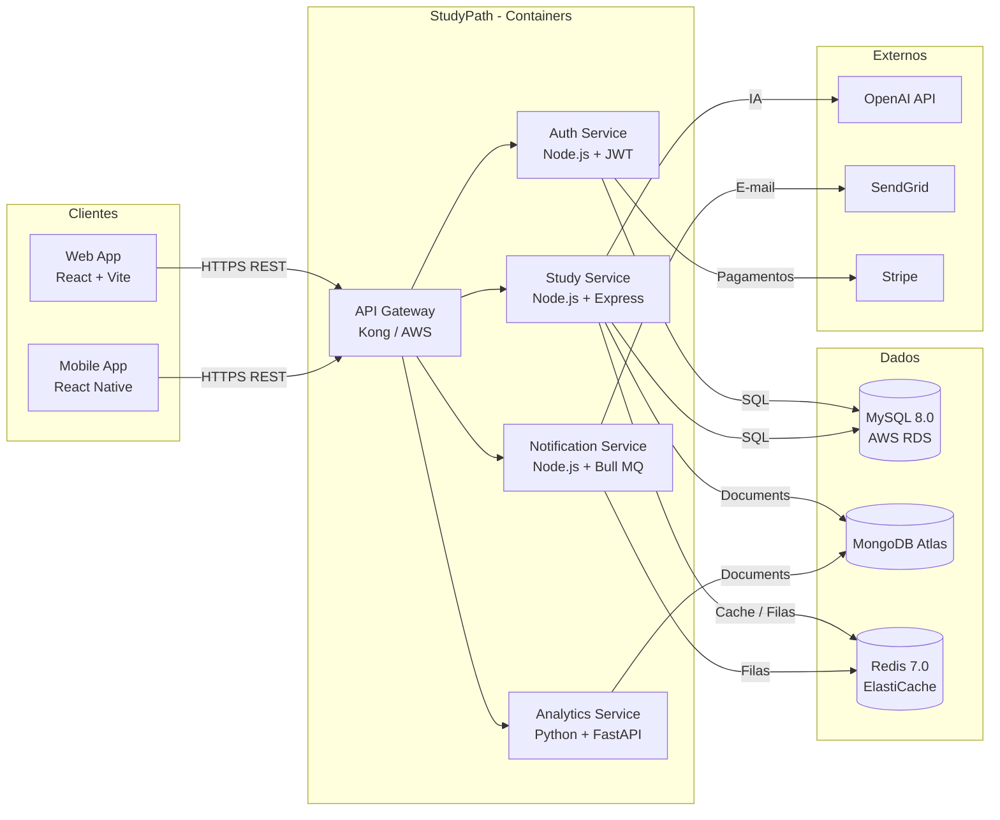

# C4 — Nível Container (C2): StudyPath

## Diagrama

## Containers e Tecnologias

| Container | Tecnologia | Justificativa |
|-----------|-----------|---------------|
| Web App | React + Vite + TypeScript | Ecossistema maduro, build rápido, componentização eficiente |
| Mobile App | React Native | Código compartilhado com Web, deploy iOS e Android, suporte offline |
| API Gateway | Kong / AWS API GW | Rate limiting, JWT centralizado, roteamento para microsserviços |
| Auth Service | Node.js + JWT | Alta performance para I/O, JWT stateless, OAuth 2.0 nativo |
| Study Service | Node.js + Express + Prisma | Assincronismo, ideal para operações de leitura/escrita frequentes |
| Analytics Service | Python + FastAPI | Python líder em análise de dados; FastAPI com tipagem via Pydantic |
| Notification Service | Node.js + Bull MQ | Bull MQ usa Redis para filas confiáveis com retry automático |
| MySQL 8.0 | AWS RDS | ACID compliance para dados críticos; backups e failover automático |
| Redis 7.0 | AWS ElastiCache | Cache de baixíssima latência para sessões, streaks e rate limiting |
| MongoDB Atlas | Atlas Cloud | Esquema flexível para flashcards heterogêneos e logs analíticos |
