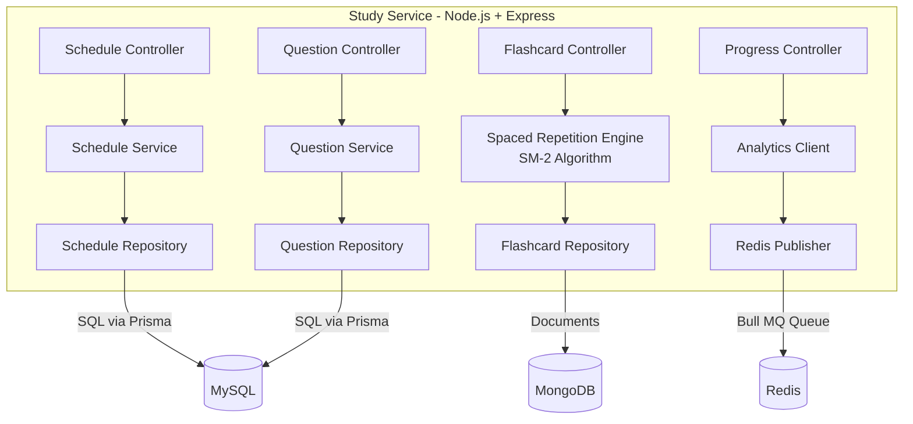

# C4 — Nível Component (C3): Study Service

## Diagrama

## Responsabilidades dos Componentes

| Componente | Camada | Responsabilidade |
|-----------|--------|-----------------|
| Schedule Controller | Controller | Recebe requisições HTTP, valida payload com Zod, delega ao Schedule Service |
| Schedule Service | Service | Gera cronograma baseado no diagnóstico, disponibilidade e datas das provas |
| Schedule Repository | Repository | CRUD no MySQL via Prisma ORM para cronogramas e sessões |
| Question Controller | Controller | Endpoints de listagem, filtro por banca/matéria e submissão de respostas |
| Question Service | Service | Filtra questões, corrige respostas, calcula pontuação e atualiza aproveitamento |
| Question Repository | Repository | Acessa banco de questões e respostas do aluno no MySQL |
| Flashcard Controller | Controller | Rotas para criar cards, iniciar sessão de revisão e registrar resultado |
| Spaced Repetition Engine | Service | Implementa algoritmo SM-2: calcula próximo intervalo de revisão (0–5) |
| Flashcard Repository | Repository | Persiste flashcards, histórico de revisões e próximas datas no MongoDB |
| Progress Controller | Controller | Mapa do edital — marca tópicos como Pendente, Revisando ou Dominado |
| Analytics Client | Client | Publica eventos de uso para o Analytics Service via HTTP |
| Redis Publisher | Infrastructure | Publica mensagens nas filas Bull MQ para notificações e streaks |
